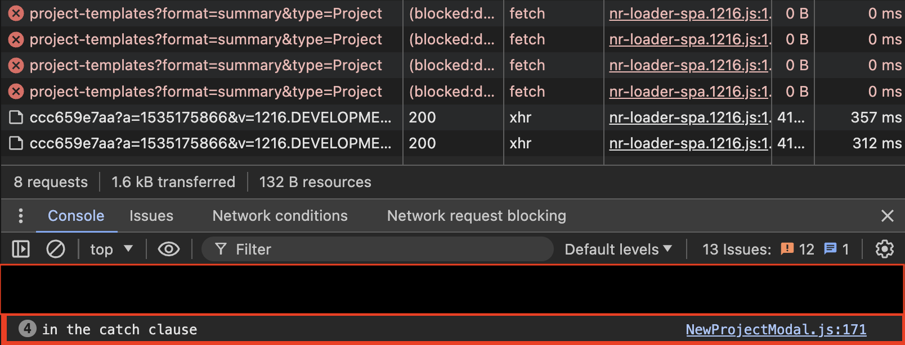

We have a React component that performs a mutation in an event handler.

```javascript title="async-mutation-handler.jsx"
(async () {
    try {

      const response = await fetch(url, {
        method: 'GET',
        headers: {
          'Content-Type': 'application/json',
          Authorization: token
        }
      });

      const body = await response.json();

      if (response.ok) {
        this.setState({ ... });
      } else {
        this.setState({ ... });
      }
    } catch (error) {
      this.setState({ ..., error });
    }
  })();
```

## Adding a Timeout

We can use the AbortController to terminate the request if we hit our timeout limit.

> The **`AbortSignal`** interface represents a signal object that allows you to communicate with an asynchronous operation (such as a fetch request) and abort it if required via an [`AbortController`](https://developer.mozilla.org/en-US/docs/Web/API/AbortController) object.
>
> https://developer.mozilla.org/en-US/docs/Web/API/AbortSignal

```javascript title="async-mutation-handler-with-timeout.jsx" ins={4,15}
(async () {
    const timeout = REQUEST_TIMEOUT;

    const signal = AbortSignal.timeout(timeout);

    const asyncFnWithTimeout = async () => {
      try {
        ...
		const response = await fetch(url, {
          method: 'GET',
          headers: {
            'Content-Type': 'application/json',
            Authorization: token
          },
          signal: signal
        });

        const body = await response.json();
         ...
      } catch (error) {
	      ...
    };

    await asyncFnWithTimeout();
  })();
```

## Adding Retry Behaviour

We trigger a retry if we encounter an error.

```javascript title="async-mutation-handler-with-timeout-and-retries.jsx" ins={2,16-20, 26-30}
(async () {
    let retriesLeft = MAX_RETRIES = 3;

    const timeout = REQUEST_TIMEOUT;

    const signal = AbortSignal.timeout(timeout);

    const asyncFnWithTimeoutAndRetries = async () => {
      try {
        ...
        const response = await fetch(url, options);

        const body = await response.json();

        if (!response.ok) {
          if (retriesLeft > 0) {
            retriesLeft -= 1;
            await new Promise(() =>
              setTimeout(getProjectTemplates, RETRY_DELAY_MS)
            );
          } else {
            // no retries left, do some final state update
          }
        }
      } catch (error) {
        if (retriesLeft > 0) {
          retriesLeft -= 1;
          await new Promise(() =>
            setTimeout(getProjectTemplates, RETRY_DELAY_MS)
          );
        } else {
          // no retries left, do some final state update
        }
      }
    };

    await asyncFnWithTimeoutAndRetries();
  })();
```

We retry if we encounter an error. A `do ... while` loop would be a better way to achieve this but we are constrained by our need to update state, which is conditional on where in the retry loop we are. We only ever want to update state when we are at the end of the retry loop.

It is important to enforce a delay before running the retry.

```javascript
await new Promise(() => setTimeout(getProjectTemplates, RETRY_DELAY_MS));
```

Without this delay the retry will run immediately, which is what we see in the attached screenshot. A retry is likely needed because of network troubles. It makes sense to space out the requests, giving us a better chance to hit a healthy server.



## References

1. https://markmichon.com/automatic-retries-with-fetch/. Same general approach. Isn't React specific.
