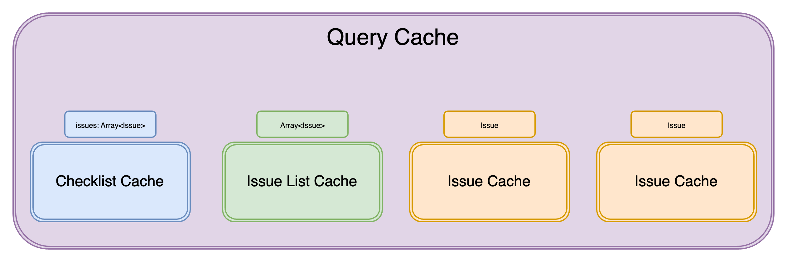
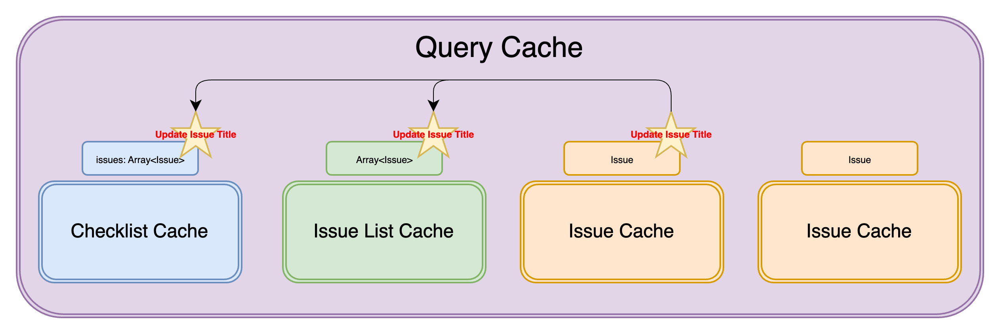
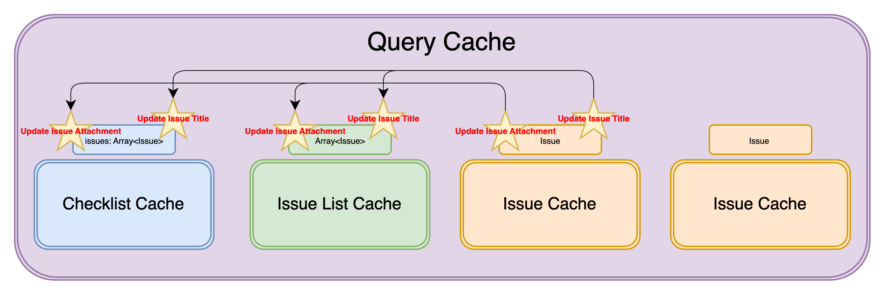
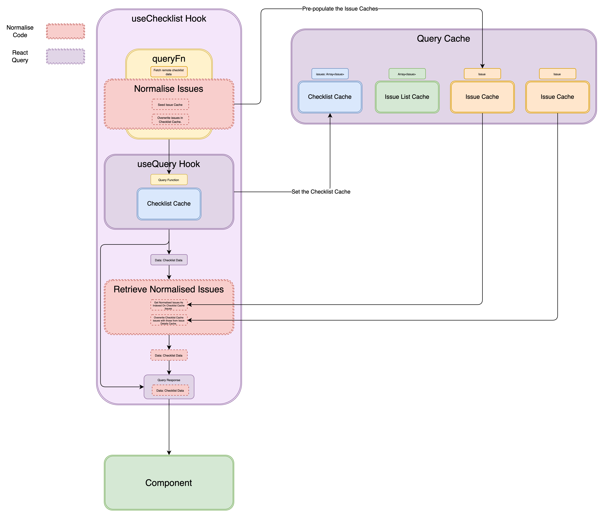
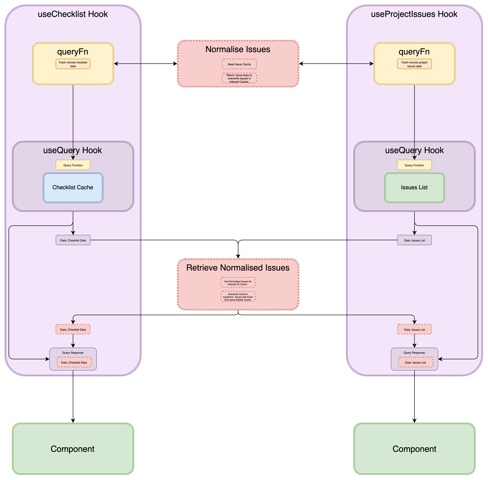

## Issues, Issues, Everywhere, But Not a Single Source of Truth

Let's start with some schemas.

We have an IssueCache type.

```typescript
type IssueCache = {
	data: Object;
};
```

We have a ChecklistCache type which has issues declared on it.

```typescript
type ChecklistCache = {
	issues: Array<IssueCache>;
};
```

And an IssueListCache type which also references a list of issues.

```typescript
type IssueListCache = Array<IssueCache>;
```

In our product, issues are shown on three screens:

- Listed against a checklist.
- Standalone in a detail view.
- Listed for the entire project.

Supporting these three screens are different underlying queries in the **query cache**: [the storage mechanism for Tanstack Query](https://tanstack.com/query/v4/docs/reference/QueryCache).

The checklist, containing a list of issues, is one query in the cache. It has the query key `['checklist', projectId, checklistId]`.

The issues list, containing a list of all issues on the project, is another query in the cache. It has the query key `['issues-for-user-on-project', projectId, userId]`.

Lastly, each individual issue features as a query in the cache. Each entry has a query key of the pattern `['issue', projectId, issueId]`.



And all was well.

However, we did have a task of synchronising the different cached queries. For instance, updating an specific issue didn't just require updating the one Issue Cache, but making an equivalent update in the Checklist and Issues List Caches, too.



At first, this worked fine. The cost of synchronisation[^1] was manageable, despite it being a totally _manual_ task of remembering to do so. However, this soon changed. We introduced support for attachments on an issue.

```typescript
type IssueCache = {
	data: {
		attachmentIds: Array<AttachmentId>;
	};
	attachments: Record<AttachmentId, Attachment>;
};
```

In doing so we had increased our synchronisation cost dramatically. Any operation on an issues' attachment required synchronising with the other caches (Checklist, Issues List).



Surely there was a better way. Enter normalising issue data in the query cache.

### Normalising Issues in the Query Cache

This involved making sure the issues in the Checklist and Issue List Caches' were indexing the Issue Cache. To achieve normalising of issue data across the query cache we needed to complete two steps:

1. First, we seeded the Issue Caches' with issue data, linking any relevant queries to these entries.
2. Next, we made sure that every time we fetched issue data (like when pulling a checklist or the issues list), we used the Issue Cache as our source of issue data.

Our normalisation journey started with the Checklist Cache.



#### Normalising Issues Data (Pre-populating the Issue(s) Cache)

The remote source for checklist data gave us the full spread of issue data. So, we decided to pre-populate the Issue Detail Caches at the point that we fetched the checklist. This can be seen in the Normalise Issues section above and in the code below.

```javascript
function fetchChecklist() {
	const checklist = fetch;

	const { issues } = checklist;

	for (const issue of issues) {
		const issueDetailQueryKey = ["issue", projectId, issue.issueId];

		const issueQueryCacheValue = {
			data: issue,
			// attachments to come
		};

		QueryClient.setQueryData(issueDetailQueryKey, () => issueQueryCacheValue);
	}
}

function useChecklist() {
	const queryKey = ["checklist", projectId, checklistId];

	return useQuery(queryKey, fetchChecklist);
}
```

Then, we had to set issue keys on the Checklist Cache—keys that pointed to the Issue queries.

```javascript
function fetchChecklist() {
  const checklist = fetch;

  const { issues } = checklist;

  for (const issue of issues) {
    ...
  }

  return { ...checklist, issues: issues.map((issue) => issue.issueId) };
}
```

But if we left it this way, we’d break the signature of the `useChecklist` hook. Instead of returning a list of Issue objects, it would now return a list of Issue IDs. So, we needed to replace the keys with the Issue Cache queries they pointed to. That’s what we did in the Retrieve Normalised Issues section.

#### Using the Normalised Issues (Retrieval)

```javascript
function useChecklist() {
	const queryKey = ["checklist", projectId, checklistId];
	const query = useQuery(queryKey, fetchChecklist);

	const { status, data, error, isFetching } = query;

	if (data == null) {
		return query;
	}

	let elaboratedIssues = [];

	for (const issueId of data.issues) {
		const issueQueryKey = ["issue", projectId, issueId];
		const issueDetail = queryClient.getQueryData(issueQueryKey);
		elaboratedIssues.push(issueDetail);
	}

	return {
		...query,
		data: {
			...data,
			issues: elaboratedIssues,
		},
	};
}
```

We made sure to retrieve issues synchronously. Refetching would be wasteful. Each trip to the server would pull data we already had cached. Worse, it’d be costly. Every checklist would need a round trip to the server for its data, and each issue on it would demand the same.

```javascript
...

const issueQueryKey = ['issue', projectId, issueId];

// ✅ We used the synchronous "getQueryData" method to resolve Issue Query.
const issueDetail = queryClient.getQueryData(issueQueryKey);

// ❌ We do not allow for refetching of the corresponding Issue Query.
const { data: issueDetail } = useQuery(issueQueryKey)
```

By taking this approach, we _sort of_ decoupled the fetching of an issue from its retrieval from the query cache. It's almost as though we are managing the fetching of the issue by proxy--through the checklist and issues list queries. Typically, each query in the cache carries its own method to refresh itself.

These issue cache queries still have background data-fetching functions; we just chose not to resolve the normalised issue using the useQuery hook. This was deliberate: we want to avoid triggering a background refetch for revalidating the data. [Recall that every time the useQuery hook mounts, a background refetch for that query will run.](https://tkdodo.eu/blog/react-query-as-a-state-manager#letting-react-query-do-its-magic)

Undoing the overwriting of issues on the Checklist Query Cache might seem a bit backwards, but this approach means the issue data in the Checklist Query Cache is fully normalised. Keys in the Checklist Query data now index entries as Issue Cache entries. Yet, from the caller's perspective, nothing has changed, the signature of the useChecklist hook is unchanged—they still receive the issues in full detail. It was essential that we had a bias for maintaining the contract of the hook.

The _full_ function became:

```javascript
function fetchChecklist() {
	const checklist = fetch;

	const { issues } = checklist;

	for (const issue of issues) {
		const issueDetailQueryKey = ["issue", projectId, issue.issueId];

		const issueQueryCacheValue = {
			data: issue,
			// attachments to come
		};

		QueryClient.setQueryData(issueDetailQueryKey, () => issueQueryCacheValue);
	}
}

function useChecklist() {
	const queryKey = ["checklist", projectId, checklistId];
	const query = useQuery(queryKey, fetchChecklist);

	const { status, data, error, isFetching } = query;

	if (data == null) {
		return query;
	}

	let elaboratedIssues = [];

	for (const issueId of data.issues) {
		const issueQueryKey = ["issue", projectId, issueId];
		const issueDetail = queryClient.getQueryData(issueQueryKey);
		elaboratedIssues.push(issueDetail);
	}

	return {
		...query,
		data: {
			...data,
			issues: elaboratedIssues,
		},
	};
}
```

But we couldn't finish here.

### Extracting Normalisation Functions for Reuse


Remember, the normalising of issue data needed to be done for the Issue List Cache as well. This meant that our implementation, specifically the steps of Normalising Issues and Retrieving Normalised Issues, needed to be extracted.



[^1]: What seems like duplication often isn't. Entries in the query cache can be tied to specific views. A checklist might show only a summary of an issue's properties, while the detail view reveals everything. Each view needs different data to fulfil the UI. So, the query cache for each is distinct.
