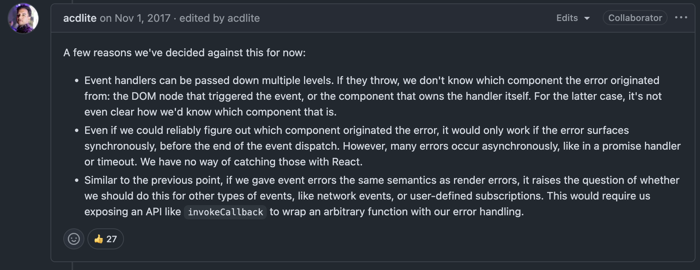
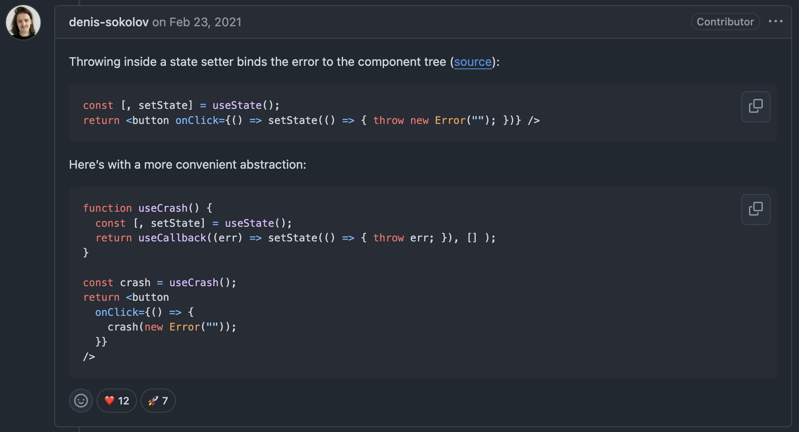

## Errors Are Like Socks in the Laundry – They Mysteriously Disappear

Turns out I don't know how error boundaries work in React Router or React, for that matter.

The `errorElement` defined on a route only catches errors thrown in loaders, actions, or **during component rendering**. What do we mean by **component rendering**? We mean the render and lifecycle methods that describe the render and commit phase of React. Errors in these phases, seen below, will be caught by an error boundary.

```javascript
function TestRoute() {
	throw new Error("Uhhh ohh");
	return <div>Test Route</div>;
}
```

<br/>

```javascript
function TestRoute() {
	useEffect(() => {
		throw new Error("Uhhh ohh");
	}, []);

	return <div>Test Route</div>;
}
```

However, errors that do not occur during component rendering aren't handled by error boundaries. Most critically, these include the scenarios below. Both of these will result in an unhandled promise rejection and cause your application to crash.

1. **Error Thrown in Asynchronous Code**

   The limitation is described in the official, though out-of-date, [documentation](https://legacy.reactjs.org/docs/error-boundaries.html#how-about-event-handlers).

```javascript
function TestRoute() {
  useEffect(() => {
	  async function onMount() {
		  throw new Error('Uhhh ohh');     <-- not caught by error boundary
	  }

	  onMount();
  }, [])

  return <div>Test Route</div>;
}
```

2. **Error Thrown in an Event Handler**

   The limitation is described in the official, though out-of-date, [documentation](https://legacy.reactjs.org/docs/error-boundaries.html#how-about-event-handlers).

```javascript
function TestRoute() {
	return (
		<div
			onClick={() => {
				throw new Error("Uhhh oh");
			}}
		>
			Test Route
		</div>
	);
}
```

## Understanding Why Things Are the Way They Are

It's a design decision made by React and it makes sense. React is concerned with rendering and not necessarily everything that happens _outside_ of it. Asynchronous code and event listeners run outside the render and commit phases of React and therefore do not have their errors managed by React.

A good explanation for why React does not catch errors emitted from event handlers can be seen below. Furthermore, it makes more sense to handle these errors in the context, the component, they occur in instead of bubbling beyond this scope.


[Why are Error Boundaries not triggered for event handlers](https://github.com/facebook/react/issues/11409#issuecomment-340859253)

## Sounds Worrying. Is It Really Such a Big Deal?

Not really. For event listeners, errors should be handled locally, not bubbled up the tree. For asynchronous code, good developers use try-catch blocks or libraries like React Query that handle errors for you.

### But ... Forwarding Errors to an Error Boundary: Could We Do It?

1. **Binding the Error to the Component Tree**


[Why are Error Boundaries not triggered for event handlers](https://github.com/facebook/react/issues/11409#issuecomment-783309449)

This obviously requires a bit of a _hack_. [We are forcing the asynchronous error into the React render phase using a hammer](https://medium.com/trabe/catching-asynchronous-errors-in-react-using-error-boundaries-5e8a5fd7b971).

```javascript
function useAsyncError() {
	const [_, setError] = useState();

	return useCallback(
	(error: Error) => {
	  setError(() => {
		throw error;
	  });
	},
	[setError]
	);
}


function TestRoute() {
	const asyncThrow = useAsyncError();

	useEffect(() => {
	  async function onMount() {
		  throwAsync(new Error('Uhhh ohh'));
	  }

	  onMount();
	}, [])

	return <div>Test Route</div>;
}
```

2. **Global Error Boundary Listens to Unhandled Promise Rejections**

We could update the global error boundary to [catch unhandled promise rejections](https://eddiewould.com/2021/28/28/handling-rejected-promises-error-boundary-react/).

```javascript
class ErrorBoundary {
    private promiseRejectionHandler = (event) => {
        this.setState({
            error: event.reason
        });
    }

    public state = {}

    public static getDerivedStateFromError(error): {}

    public componentDidCatch(error, errorInfo) {}

    componentDidMount() {
        window.addEventListener('unhandledrejection', this.promiseRejectionHandler)
    }
```

I prefer not to. While it would handle both synchronous and asynchronous errors, it gives you less control by using a broad approach. Using a global error handler can work in simple applications, but it can cause issues in more complex scenarios:

1. **Nested Error Boundaries**: With multiple layers of error boundaries, it's hard to decide which boundary should catch the error, and some errors might not need to stop the entire app.

2. **Multiple React Apps**: If several React apps are on the same page, they'll all catch the same error, even if it comes from a different app.
