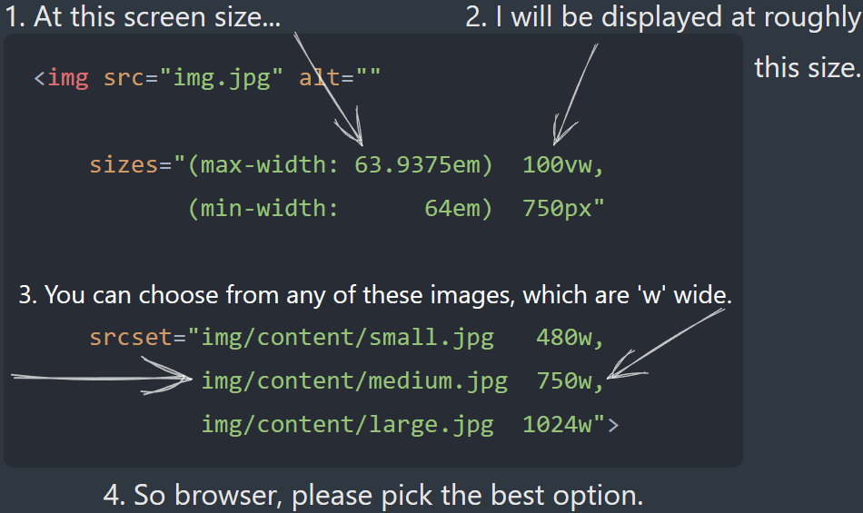

## Image Element Attributes src & srcSet

> We estimate that 33% of desktop pages are loading more than ==83 KB== of **extra image data**, based purely on bad sizes attributes. That is to say: A better, smaller resource is there for the picking in the srcset, but because the sizes attribute is so erroneous, the browser doesn't pick it. Additionally, 10% of desktop pages that use sizes load more than ==0.5 MB== of excess image data because of bad sizes attributes!
>
> Web Almanac, [HTTP Archive](https://almanac.httparchive.org/en/2022/media#srcset)

We do a pretty poor job of handling for **responsive images**. There are two things we should consider when downloading an image:

1. The size of the image.
2. The (pixel) density (resolution) of the image.

We should neither download an image too big or rich in pixels, for our purpose. Take the very simplified example below. We are loading an image completely ignorant of the dimensions of the browsers viewport and the resolution of the users screen. Users, whether using desktop or mobile, will get the same image (size and resolution). [On mobile, we degrade website performance through long download times, waste user data volume and tax the CPU by decoding+rendering larger images (which also increases battery usage)](https://kurtextrem.de/posts/modern-way-of-img#pixel-density-descriptors).

```html

```

### Implementing Responsive Images

But how can we better support responsive images? Using two attributes, `sizes` and `srcSet`, we can give the browser opinionated options as to what image to download. Through these attributes, we can give **control to the browser** ‒ essentially telling the browser ["you're in charge of figuring out which image is best to load"](https://kurtextrem.de/posts/modern-way-of-img#comes-with-surprises-img-srcset).

`srcSet` is a [comma-separated list of URLs](https://ericportis.com/posts/2014/srcset-sizes/) for the available versions of the image; with each image's intrinsic width is specified using the `w` descriptor. While `sizes`[^2] [communicates how large the image will render within the layout](https://ericportis.com/posts/2014/srcset-sizes/), the size the image will render relative to the viewport, expressed as the width of the slot the image will take. The `sizes` attribute also supports media query condition to specify the width of the slot. Taken together, [`srcSet` tells the browser the dimensions the image _has_, while `sizes` tells it the size it should _be_](https://www.smashingmagazine.com/2014/05/responsive-images-done-right-guide-picture-srcset/).

Say we have three versions of our image:

- `large.jpg` (1024 x 768)
- `medium.jpg` (640 x 480)
- `small.jpg` (320 x 240)

And we have our image markdown:

```html

```

The browser determines which source it should use as follows:

- The page renders. The browser is aware of the viewport size.
- The browser consults the `sizes` attribute and finds the media condition that satisfies the state of the view port. It takes the corresponding width of the slot.
- The browser consults the `srcSet` to find the source with the closest `w` descriptor matching the width of the slot.

Let's consider our example. Per our `sizes` declaration, when the viewport is 36em or larger, the browser should render an image at 33.3% of the viewport's width. Say we have a viewport with a 1X display around 90em wide. That means the image should display at roughly 30em wide—about 480 pixels. This means the browser picks the--[most appropriate](https://css-tricks.com/a-guide-to-the-responsive-images-syntax-in-html/#aa-creating-accurate-sizes)--medium-sized image, as its width (640 w) is closest to the calculated 33.3vw (480 px)[^1].

A good illustration of this process can be found [below](https://kurtextrem.de/posts/modern-way-of-img#width-descriptors).



But what if the device had a 2X display? Wouldn't we want to render an image with higher resolution? Enter device pixel ratios.

### Handling Device Pixel Ratios (DPR)

High-resolution screens should get high-resolution images; low-resolution screens, incapable of rendering the pixel density, should be [spared the cost](https://www.smashingmagazine.com/2014/05/responsive-images-done-right-guide-picture-srcset/). The device pixel ratio describes the density of the image. Browsers compare this number against the devices own native device pixel ratio to determine which source image to pick. The rules used to pick the source image differ across browsers.

One way to inform browsers of different resolution options is to use the `x` descriptor in the `srcSet`. [`x` descriptors allow you to serve responsive images for devices with various device pixel ratios (DPR)](https://www.debugbear.com/blog/responsive-images#x-descriptors).

```html

```

We've set three image files—1x, 2x, and 3x—for screens with device pixel ratios of 1, 2, and 3. On a 1x display, the browser picks the 1x file. On a 2x, it grabs the 2x. On a 3x, the 3x. As indicated by the explicit width and height, [this approach is best suited](https://docs.imgix.com/en-US/getting-started/tutorials/responsive-design/responsive-images-with-srcset#using-srcsets-with-dpr) for fixed image layouts where the rendered size of an image element is not expected to change.

But what if we don't have a fixed image layout? What if we need to support flexible image rendering, where the size of the image can change depending on the browsers viewport? We know that to support flexible image layouts we need to use the `w` descriptor, which means we must drop the `x` descriptor. So, how do we maintain support for different resolution images?

Fortunate for us, when [browsers evaluate width descriptors, they also take DPR into consideration](https://www.debugbear.com/blog/responsive-images#w-descriptors-and-the-sizes-attribute). They do this by calculating the image density of each source and comparing this against the devices own DPR. The image density is the [product of dividing the `w` descriptor of the picked source by the "source size" of the image, which is the size that the image renders as (as determined from the `sizes` attribute)](https://kurtextrem.de/posts/modern-way-of-img#width-descriptors). What does this mean? Let's return to our previous example.

```html

```

Let's say our device has a 1X display. To determine the image density of each image source in the `srcSet`, the the browser divides the image's intrinsic width by the rendered width.

```markdown
(intrinsic width) / (rendered width) = image density;

// The image density of `medium.jpg`.
320 / 360 = 0.88 ...;

// The image density of `medium.jpg`.
640 / 360 = 1.78 ...;

// The image density of `large.jpg`.
1024 / 360 = 2.84 ...;
```

Browsers then compare the image density of the available sources against the devices own DPR. Firefox and Safari pick the source with a higher density than the device's DPR—in this case, the `medium.jpg` variant as 1.78x is greater than 1x. Chrome takes a little different an approach. In doing so, the browser chooses an image larger than the layout demands, ensuring it delivers sharper details the device can display. Furthermore, for 2x displays, Firefox and Safari will load `large.jpg` since it's the only source with a density higher than 2x.

It it worth noting that Imgix is a fantastic service that simplifies the use of responsive images through srcSet and sizes attributes. For details on caching Imgix responses for offline image support, see [[Images for Offline Use]].

[^1]: An important note: In many examples, resizing the browser viewport triggers responsive image loading. Scaling up the viewport prompts requests for larger images, while scaling down triggers requests for smaller ones. In Chrome, this behaviour is only observed when scaling the viewport up. [In scaling down, Chrome already has a higher resolution image in its cache and therefore does not substitute a lesser image for it](https://youtu.be/2QYpkrX2N48?t=1000). There is no point for it to request a lesser quality image. This would be a waste of bandwidth. The behaviour remains unchanged if you disable the cache. [This is a native Chrome feature where it will always decode the largest cached image because it is of the best quality](https://github.com/aFarkas/lazysizes/issues/133#issuecomment-126904028).

[^2]: It is worth noting that creating `sizes` attributes can get tricky. The `sizes` attribute describes the width that the image will display **within the layout of your specific site**, meaning it is closely tied to your CSS. The width that an image renders at is [layout-dependent](https://css-tricks.com/sometimes-sizes-is-quite-important/) rather than just viewport dependent!
