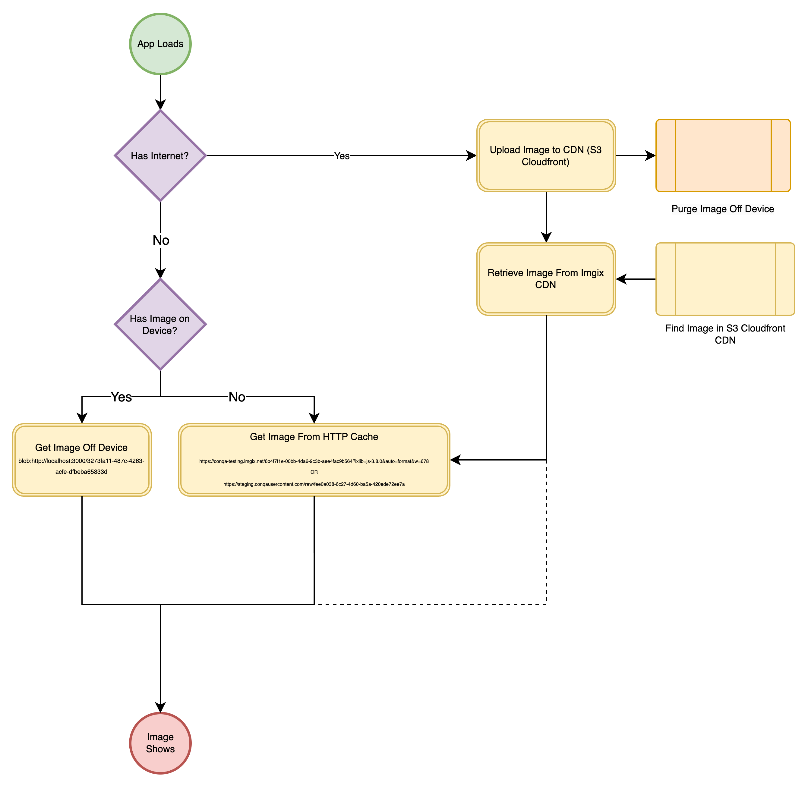
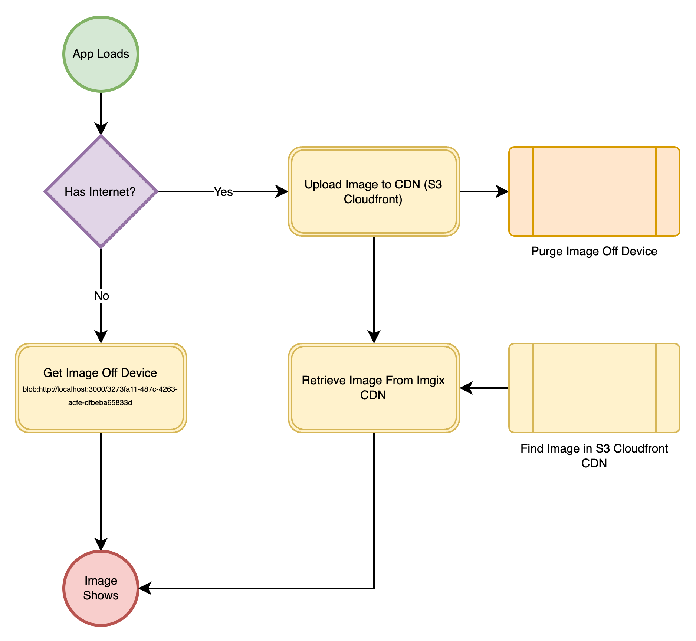
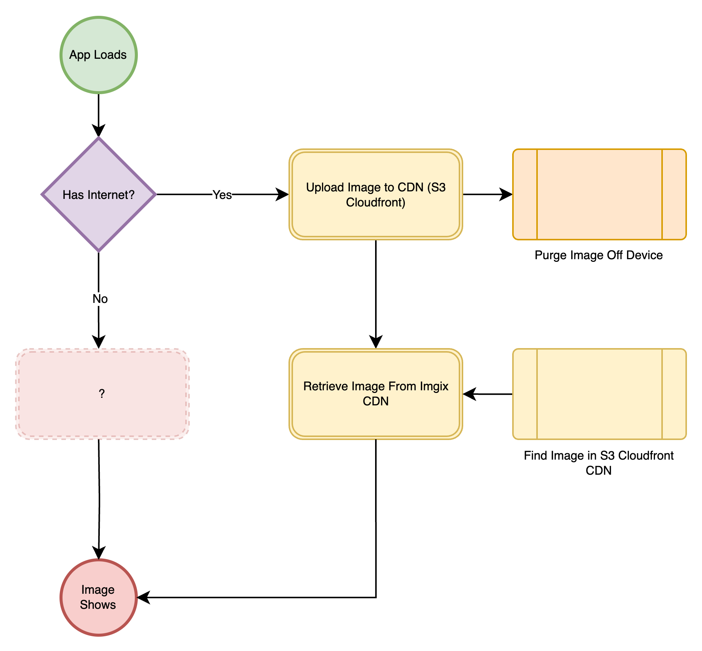
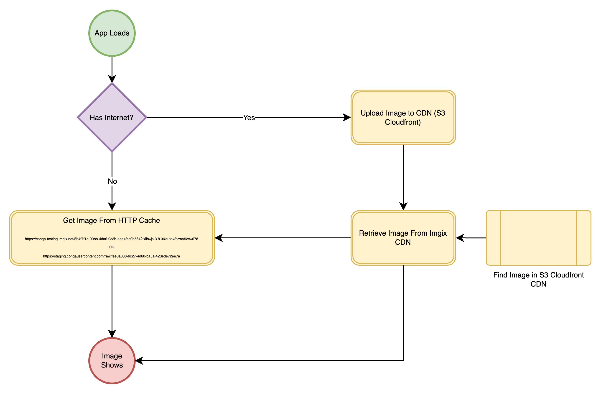

## Showing Images When Offline

How do we show images when offline?

1. We retrieve them off the users machine.
2. We retrieve them from the browsers HTTP Cache.



### Retrieving Image Off Users Device

When we upload an image offline, we persist the image to the users machine (on disk).

```markdown
// #1 Image stored on device when using localhost.
blob:http://localhost:3000/3273fa11-487c-4263-acfe-dfbeba65833d

// #2 Image stored on device when using staging.
blob:https://s3.con.qa/4aaf8614-426a-4a31-9c30-59da64b57107
```

This ensures that we can show it without having to be online. However, we cannot depend on this method because it puts too much pressure on the memory of the device. We therefore have to proactively purge these files. We perform this purge whenever we have successfully uploaded the image to our CDN (S3 with Cloudfront distribution). This purge is therefore dependant upon the user having internet access.



But this begs the question: how do we have offline support for images if we aren't getting them off the users' device? Enter HTTP Caching.



### HTTP Caching

The client makes a request to Imgix. Imgix receives the request and refers to our S3 Cloudfront CDN as its source of assets (images). The response from Imgix has cache controls set on it that tell the browser to cache the returned image in memory, in the HTTP cache. The next time the client makes the same request the browser first consults the HTTP cache for an entry as indexed by the request address (amongst other things) and returns the image from in memory, avoiding the need to issue another request to Imgix and therefore the need to be online.



> The browser maintains an index of cached files, usually identified by a combination of the URL and other metadata (like query strings or headers). When the webpage requests an image the browser checks if the cached version is valid and will skip requesting and downloading the image and use the cached copy. The browser saves the image in an HTTP cache, allowing it to be read from disc.

**As long as the images are in the HTTP cache the user does not need to be online to see them in the UI.**

### Questions

**What if there is nothing in the browser cache and the user is offline?**

Well, assuming there is also no image persisted on the device, no image will show.

**What if there is nothing in the browser cache, the user is online and the request to Imgix fails?**

We offer a fallback in the event that the request to Imgix fails. We try to retrieve the image from our own CDN.

```html

```

The fallback image won’t load unless we clear srcSet. To handle this, we need to catch the failed Imgix request using the onerror handler and use it as an opportunity to unset srcSet.


```html
 setIsImgixError(true) }
/>
```

If the fallback request also fails then no image will show.
