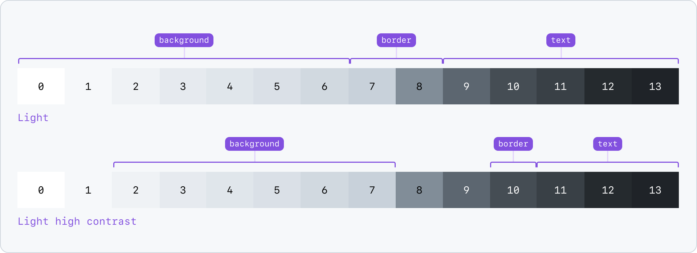
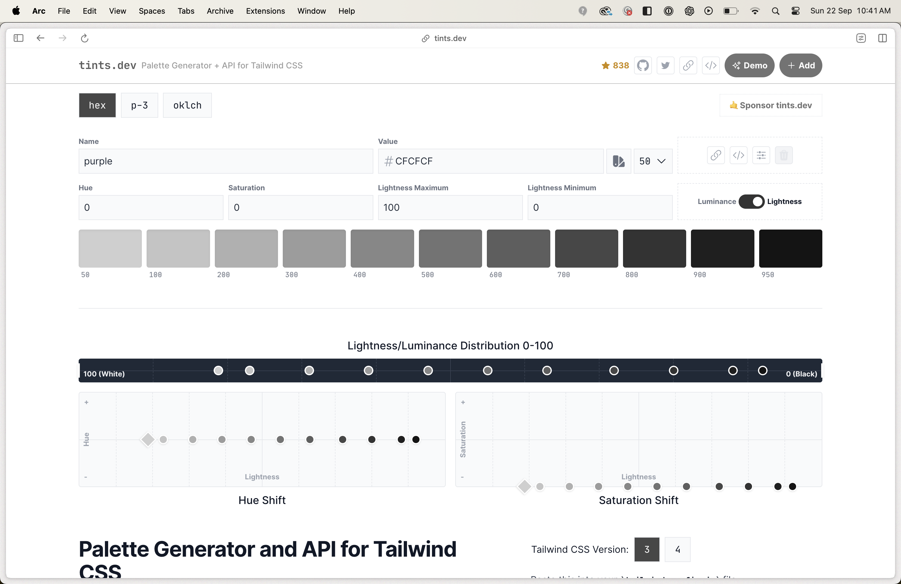
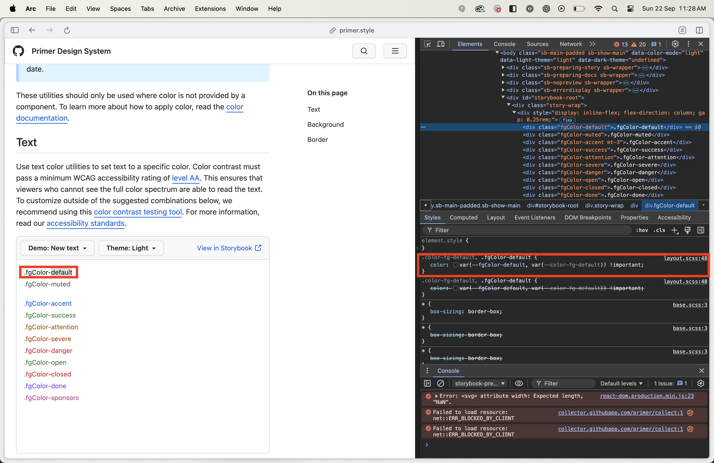
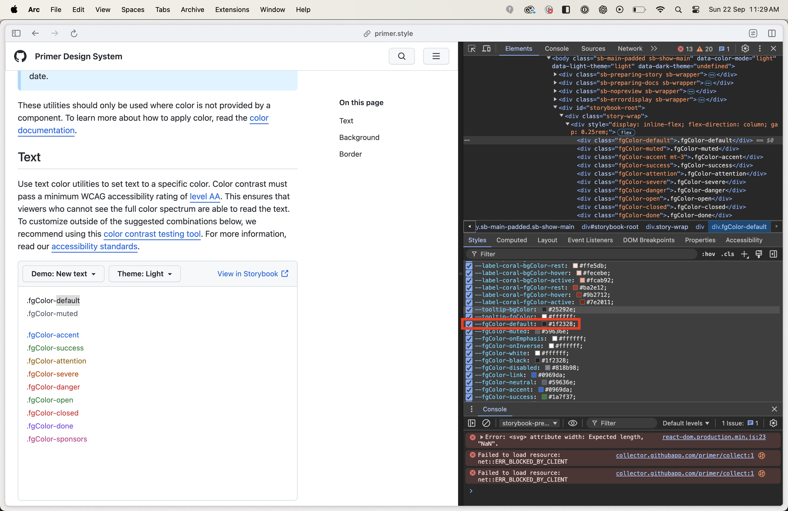
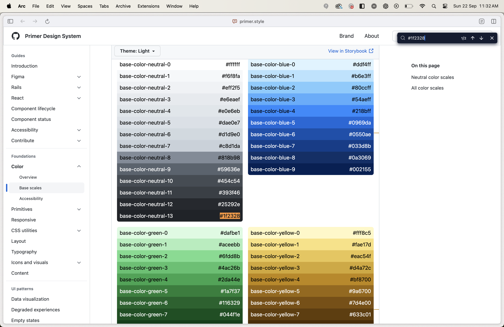

## Where'd You Get Those Colour Tokens, Bro?

I've mostly taken my influence from Github's design system [Primer](https://primer.style/). I decided to start with colours. Primer makes use of design token categories. Per their fantastic [documentation](https://primer.style/foundations/color/overview).

- **Base Tokens:** These are the raw, primitive tokens. They hold the basic values. Use them only as a guide for building functional and component patterns. Never use them directly in code or design.

  - An example would be `colors.neutral.50` which maps to a CSS variable declared in the root stylesheet `--base-colour-neutral-50: 0deg 0% 81% || #CFCFCF`.

- **Functional Tokens:** These represent global UI patterns such as text, borders, shadows, and backgrounds. These are the most commonly used design tokens.
  - An example would be `bgColour-default` which maps to the base colour token `colors.neutral.50`.

I took influence in how Primer approaches colour palettes. It breaks a palette up into functional ranges. For instance, the first six steps of the neutral scales are typically used for background colours, accessible with the functional token property `bgColour`. The two most commonly used background colours are `bgColor-default` (scale index 0) and `bgColor-muted` (scale index 1). All this information can be found on the [Primer base scales page](https://primer.style/foundations/color/base-scales).



```typescript title="tailwind.config.ts"

colors: {
	...,
	["site-palette"]: {
		blue: "hsl(var(--theme-text) / <alpha-value>)",
		grey: "hsl(var(--theme-bg-default) / <alpha-value>)" || "#CFCFCF",
		red: "hsl(0deg 100% 50% / <alpha-value>)",
	}
}
```

When creating a color palette, I wanted to keep TailwindCSS's method of using a range from 50 to 950. I knew that `site-palette.grey` would be my default background colour, my `bgColour-default`, my starting point at index zero, my initial 50 step. To produce a Tailwind colour palette from this grey I used a [Palette Generator tool](https://www.tints.dev/purple/CFCFCF) by [Simeon Griggs](https://simeongriggs.dev/).



This generated me the following colour palette which I assigned as my neutral colour palette.

```typescript title="tailwind.config.ts"
{
  "colors": {
    "neutral": {
      50: "#CFCFCF",
      100: "#C4C4C4",
      200: "#B0B0B0",
      300: "#9C9C9C",
      400: "#878787",
      500: "#737373",
      600: "#5E5E5E",
      700: "#474747",
      800: "#333333",
      900: "#1F1F1F",
      950: "#141414"
    }
  }
}
```

Following Primer's approach, I decided to reserve the beginning of the colour range for backgrounds, the middle for borders, and the rest for high-contrast text and icons. This was the process of mapping base design tokens to their functional equivalents or [colour utilities](https://primer.style/foundations/css-utilities/colors). From the neutral palette:

- The first block would be for background colours, usable through the `bgColour-*` property.
- The second block would be for borders, usable through the `borderColour-*` property.
- The third block would be for text and icons, usable through the `fgColour-*` property.

Since I used `site-palette.grey` as my starting point, which was my current default background colour, I knew I had at least two functional tokens: `bgColour-default` and `bgColour-muted`.

```typescript title="designTokens.ts"
["bgColour-default"]: baseColourTokens.neutral["50"],
["bgColour-muted"]: baseColourTokens.neutral["100"],
```

I set out to define my foreground range. Foreground colour tokens use the `fgColour` property and are applied to text and icons, a concept Primer outlines [here](https://primer.style/foundations/color/overview#foreground) and [here](https://primer.style/foundations/css-utilities/colors#text). I started with an arbitrary choice: `700: "#474747"`, a shade on the darker end. Using a [contrast checker](https://webaim.org/resources/contrastchecker/), I tested this foreground colour against various background shades, ensuring it passed the minimum WCAG [level AA](https://www.w3.org/TR/UNDERSTANDING-WCAG20/visual-audio-contrast-contrast.html) accessibility standard. Meeting these guidelines makes content accessible to all, regardless of disability or device.

`700: "#474747"` was the minimum contrast for background colours between steps 50 and 200, but I wanted more. `800: "#333333"` stretched the range, covering steps 50 to 300, while step 900 hit the mark for 300 and 400. Like Primer, I broke my neutral colour palette into its parts: background, borders, text, icons. The base colours were split and exposed as functional tokens. Simple, effective.

```typescript title="designTokens.ts"
const baseColourTokens = {
	neutral: {
		// bgColour utilities
		50: "hsl(var(--base-colour-neutral-50) / <alpha-value>)",
		100: "hsl(var(--base-colour-neutral-100) / <alpha-value>)",
		200: "hsl(var(--base-colour-neutral-200) / <alpha-value>)",
		300: "hsl(var(--base-colour-neutral-300) / <alpha-value>)",
		400: "hsl(var(--base-colour-neutral-400) / <alpha-value>)",
		// borderColour utilities
		500: "hsl(var(--base-colour-neutral-500) / <alpha-value>)",
		600: "hsl(var(--base-colour-neutral-600) / <alpha-value>)",
		700: "hsl(var(--base-colour-neutral-700) / <alpha-value>)",
		// fgColour utilities
		800: "hsl(var(--base-colour-neutral-800) / <alpha-value>)",
		900: "hsl(var(--base-colour-neutral-900) / <alpha-value>)",
		950: "hsl(var(--base-colour-neutral-950) / <alpha-value>)",
	},
};

export const functionalColourTokens = {
	["bgColour-default"]: baseColourTokens.neutral["50"],
	["bgColour-muted"]: baseColourTokens.neutral["100"],
};
```

But how did I decide what my `fgColour-default` functional token was? I went back to Primer.

1. [Find what Primer uses for its default foreground token](https://primer.style/foundations/css-utilities/colors#text).
   
   
2. [Find the corresponding base colour token using Primer's base scales resource](https://primer.style/foundations/color/base-scales).
   

As can be seen `fgColour-default` for Primer maps to the darkest step in its neutral palette. This meant my `fgColour-default` was step `950: "#141414"`. I had my default foreground functional colour token. This ensured maximum contrast.

```typescript title="designTokens.ts"
export const functionalColourTokens = {
	...,
	["fgColour-default"]: baseColourTokens.neutral["950"],
};
```

Applying the same method to Primer's `fgColor-muted` led to `base-color-neutral-9`, the minimum contrast for text and icons. Since my minimum contrast is set at `800`, this becomes my `fgColour-muted` token. Simple, straightforward, and functional.

```typescript title="designTokens.ts"
export const functionalColourTokens = {
	...,
	["fgColour-default"]: baseColourTokens.neutral["950"],
	["fgColour-muted"]: baseColourTokens.neutral["800"],
};
```

## References

1. [Primer Base Scales](https://primer.style/foundations/color/base-scales): It offers a clear introduction to how a colour palette is divided into functional token ranges.
2. [Primer Colour Utilities](https://primer.style/foundations/css-utilities/colors/#text): This helped me to understand the chunking up of base colour tokens into functional categories or utilities.
