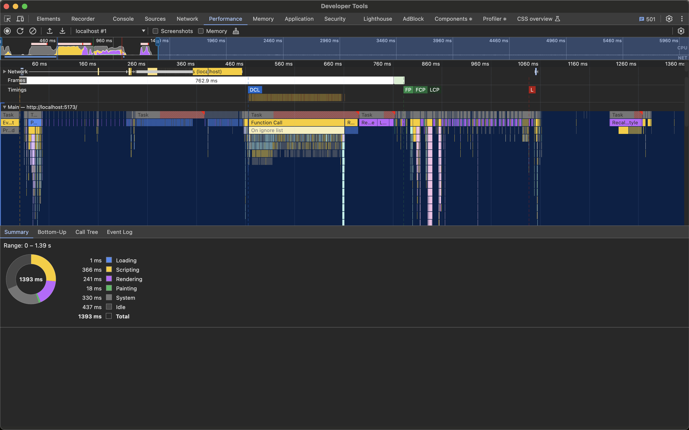
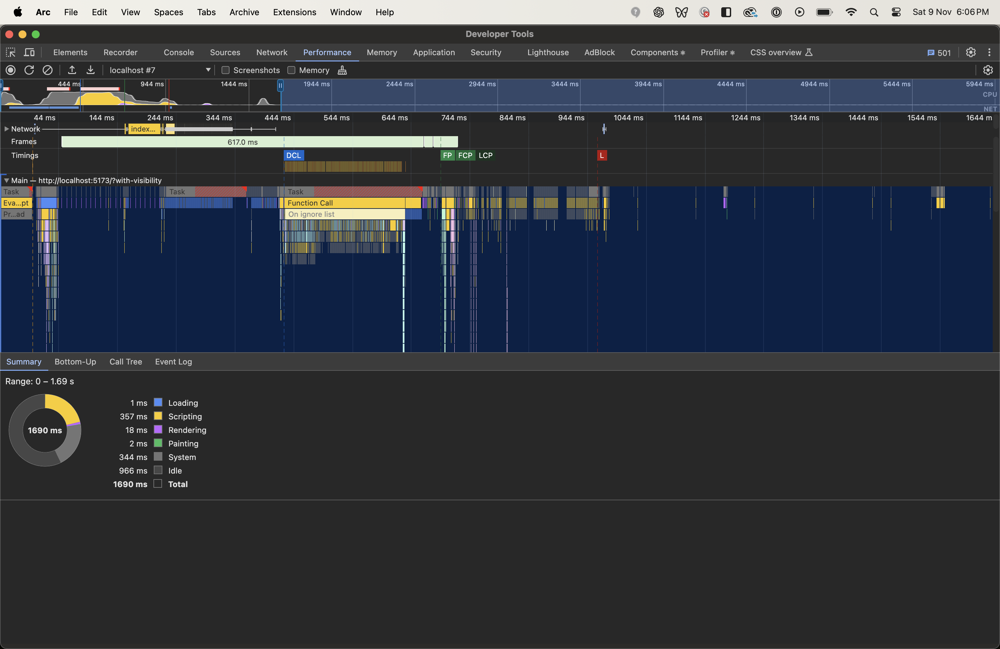
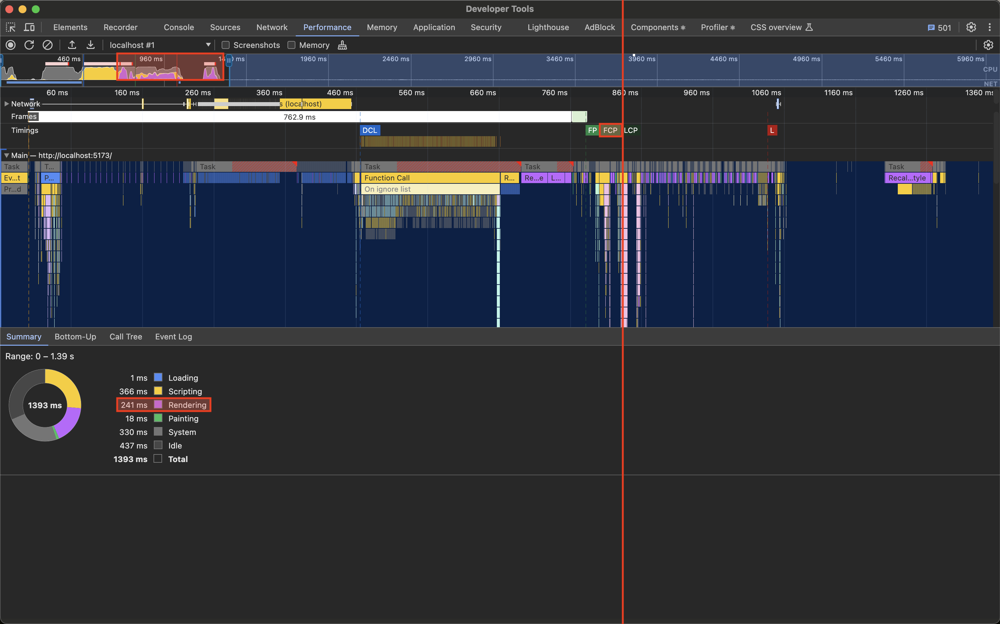
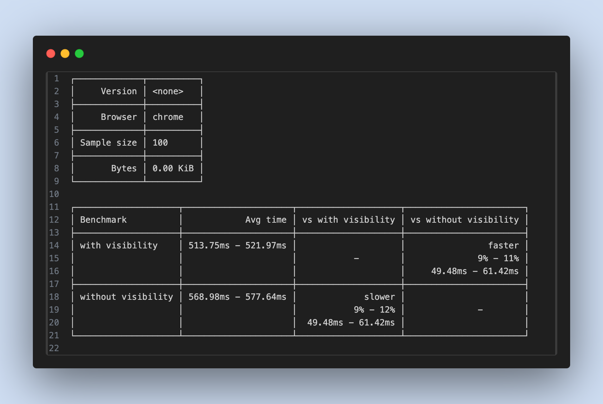

## Why Do This?

Nolan Lawson has a great article on [improving the rendering performance using CSS content-visibility](https://nolanlawson.com/2024/09/18/improving-rendering-performance-with-css-content-visibility/). It inspired me to check the possible benefit for myself.

But before I explain why `content-visibility` offers a performance benefit, I need to explain what it impacts: rendering.

## What is Rendering?

> Visual changes to a user interface are the result of several types of work, often collectively referred to as *rendering*, and this work needs to happen as quickly as possible so that the user experience feels fast and reliable.
>
> https://web.dev/articles/rendering-performance

[Performance is the art of doing less work](https://developer.chrome.com/docs/devtools/performance). Rendering is _work_. Therefore, lowering the cost of rendering is essential to achieving good performance and a good experience.

There are many methods for reducing the cost of rendering. Style calculations can be simplified. The number elements being rendered can be reduced. Render blocking resources like stylesheets can be downloaded and processed _conditionally_.

One such method for lowering the cost of rendering is to only render what is currently on screen. Doing so, we can [skip an element's rendering work, including layout and painting, until it is needed](https://web.dev/articles/content-visibility). We can do this by using the CSS containment strategy exposed by `content-visibility`.

## What is Content-Visibility?

As mentioned, `content-visibility` is a CSS containment strategy. The purpose of CSS containment is to:

> ... enable rendering performance improvements of web content by providing **predictable isolation of a DOM subtree** from the rest of the page.

It allows developers to designate chunks of the DOM that the browser does not need to do rendering work for **until** it approaches the view port. Only when a chunk comes into view does the browser do the rendering work--styling, layout. This enables the rendering work to be done just in time to be seen by the user, cutting down the initial cost of loading the page.

> Basically a developer can tell a browser what parts of the page are encapsulated as a set of content, allowing the browsers to reason about the content without needing to consider state outside of the subtree. Knowing which bits of content (subtrees) contain isolated content means the browser can make optimization decisions for page rendering.
>
> [Content-Visibility](https://web.dev/articles/content-visibility#containment)

All-in-all.

> `content-visibility` ensures that you get the largest performance gains the browser can provide with minimal effort from you as a developer.
>
> [Content-Visibility](https://web.dev/articles/content-visibility#skip_rendering_work_with_content-visibility)

### How to Use Content-Visibility

To make use of `content-visiblity`, there are two style rules that need to be set.

```html title="index.css"
<article class="example" />

<style>
	.example {
		content-visibility: auto;
		contain-intrinsic-size: 0 400px;
	}
</style>
```

It is important to set `contain-intrinsic-size`. The way `content-visibility` works, the browser skips rendering work of the **contents** of the chunk and only does the style and layout of the element box itself. This requires setting the dimensions of the element box, ensuring that it will occupy space. `contain-intrinsic-size` acts as a placeholder size in lieu of rendered content.

## Measuring the Performance Impact of Content-Visibility

For this experiment, using the starter template found here, I rendered a long--500--list of cards and measured the difference in FCP ([First Contentful Paint](https://web.dev/articles/fcp)) between an implementation that used content-visibility and one that did not.

This is without `content-visibility` defined.



And this is with `content-visibility` defined.



What is immediately apparent is the lowered rendering cost.

Without `content-visibility`, rendering lags at 241 ms. Spikes show up in the activity summary, long-winded Recalculate Style calculations show in the flame graph, and FCP stretches on.

With `content-visibility`, rendering shrinks to 18 ms. No spikes in sight. Up front rendering tasks are leaner, and FCP is quicker.



But this was a one off test. I wanted a more robust, statistically significant comparison between the two. Enter Google's Tachometer.

### Using Tachometer For Meaningful Benchmarking

To measure the impact of using `content-visibility`, I used Google's [Tachometer](https://github.com/google/tachometer?tab=readme-ov-file#auto-sample), the purpose and benefit of which I explain more in [[Why I Like Tachometer]] and Nolan does in [Reliable Javascript Benchmarking With Tachometer](https://nolanlawson.com/2024/08/05/reliable-javascript-benchmarking-with-tachometer/).

As a tool, Tachometer uses repeated sampling and statistics to reliably identify even tiny differences in runtime. It can be used to measure the timing of specific chunks of code, good for determining microbenchmarks. Or it can be used to measure the FCP between pages and by how much, with statistical significance.

Here are my results. Using `content-visibility` produced a **9 - 11% performance boost when measuring FCP**.



Since `content-visibility` affects rendering, and rendering impacts FCP, I chose to compare the FCP time difference between the two implementations. This was easy to do. Tachometer measures FCP time if the benchmark it is passed is an external URL. I ran two instances of my scratchpad project, setting it up so `content-visibility` applied only when the expected URL parameters were present.

```javascript title="Card.jsx"
export function Card() {
  const { search } = window.location;

  const useContentVisibility = search === "?with-visibility";

  return (
    <article
      className={`... ${
        useContentVisibility ? "content-visibility-auto" : ""
      }`
    />
	);
```

This was the config, declared at project root, that I passed to Tachometer.

```json title="bench.json"
{
	"$schema": "https://raw.githubusercontent.com/Polymer/tachometer/master/config.schema.json",
	"sampleSize": 100,
	"timeout": 5,
	"benchmarks": [
		{
			"expand": [
				{
					"url": "http://localhost:5173?with-visibility",
					"name": "with visibility"
				},
				{
					"url": "http://localhost:5174",
					"name": "without visibility"
				}
			]
		}
	]
}
```

And this was the script I ran.

```cli
npx tachometer --config bench.json
```
