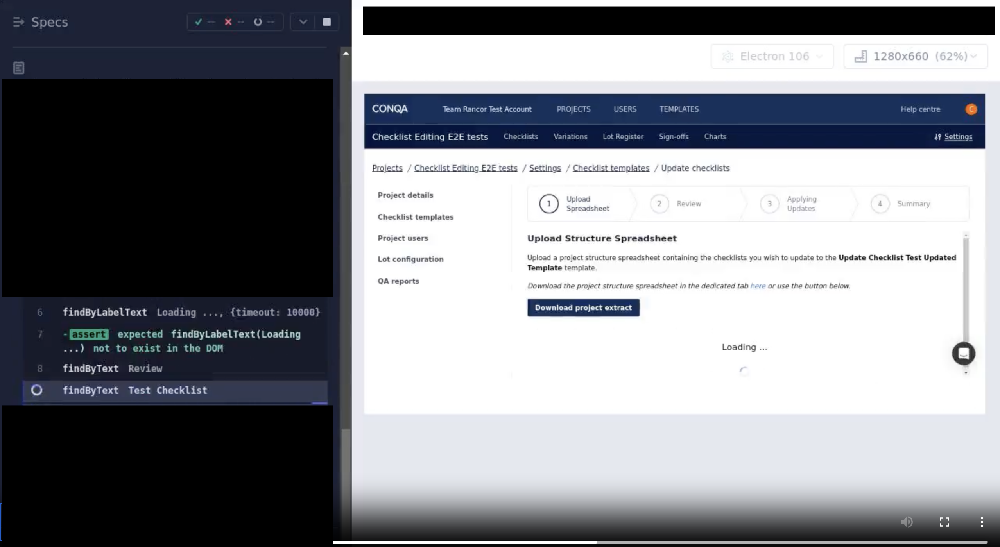
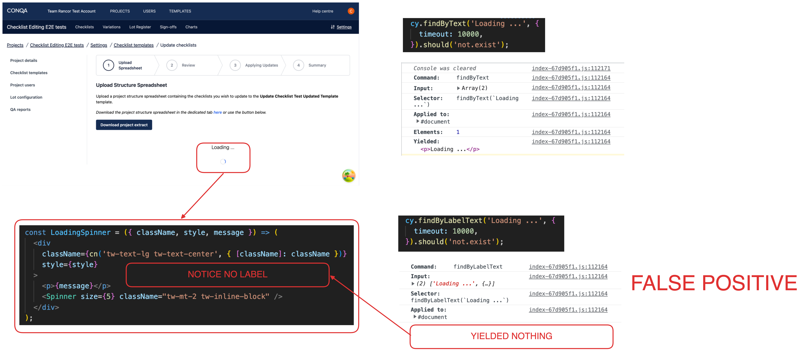

## Achtung! Be careful of false positives when testing

The example I am going to give comes from a Cypress test suite.

A test was failing because it could not find the text it expected because the loading spinner was still in the document.

As can be seen in the above image, we *think* we are writing deliberate assertions that improve the tests robustness when in fact they aren't doing anything and are false positives.

We make assertions on the loading spinner not being present **so that** we can be confident that the operation has completed and we can continue with our test. Unfortunately our method for asserting yields nothing which satisfies the check of _"does not exist"_ and so undermines our confidence in the state of what is being tested. This is flakiness.

It is worth nothing that using **findByLabelText** should and would be the preferred option had we written our components with semantic HTML.
