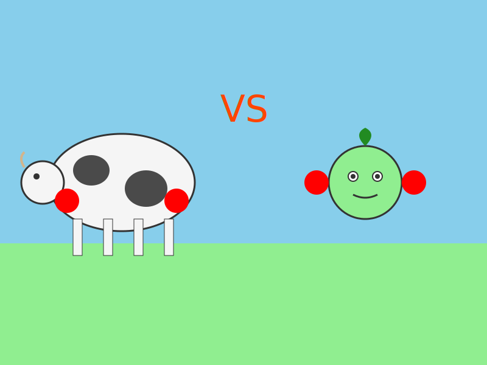

## The Natural vs Artificial Debate

When it comes to choosing between butter and margarine, the decision extends far beyond simple taste preferences. While margarine was once hailed as a healthier alternative to butter, modern scientific research has revealed quite the opposite. Let's explore why butter, in its natural glory, trumps its artificial counterpart.

## The Processing Problem

Butter is a simple, natural product made by churning cream. In contrast, margarine undergoes extensive processing:

1. Oil hydrogenation (creating harmful trans fats)
2. Deodorization
3. Artificial coloring addition
4. Emulsifier incorporation

This complex processing not only strips away nutritional benefits but can introduce potentially harmful compounds.

## Nutritional Benefits of Butter

### Essential Nutrients
Butter contains several vital nutrients:
- Vitamin A (crucial for eye health)
- Vitamin D (essential for bone health)
- Vitamin K2 (important for heart health)
- Vitamin E (a powerful antioxidant)

### Healthy Fats
Contrary to past beliefs, the saturated fats in butter aren't the villains they were once thought to be. Butter contains:
- Short-chain fatty acids that support gut health
- Conjugated linoleic acid (CLA) with potential anti-cancer properties
- Butyrate, which may help prevent inflammation

## The Margarine Misconception

While margarine was created as a "heart-healthy" alternative to butter, we now know that:
- Many margarines contained trans fats (though many manufacturers have now removed them)
- The polyunsaturated fats in margarine can become rancid when heated
- The omega-6 to omega-3 ratio in margarine can promote inflammation

## Culinary Superiority

Beyond health considerations, butter simply performs better in the kitchen:
- Creates flakier pastries
- Provides better flavor development
- Has a more stable smoking point for cooking
- Offers a richer, more satisfying taste

## Environmental Impact

Traditional butter production, especially from grass-fed cows, can be part of a sustainable agricultural system. In contrast, margarine production often relies on:
- Industrial monoculture farming
- Chemical extraction processes
- Extensive processing facilities
- Additional packaging and preservatives

## Making the Switch

If you're currently using margarine, consider transitioning to butter. Look for:
- Grass-fed options when possible
- Organic varieties to avoid pesticide residues
- Unsalted versions for more control in cooking

## Conclusion

While moderation remains key in any dietary choice, butter's natural origins, nutritional profile, and culinary properties make it the superior choice over margarine. The shift back to this traditional food aligns with both our health needs and environmental considerations.
